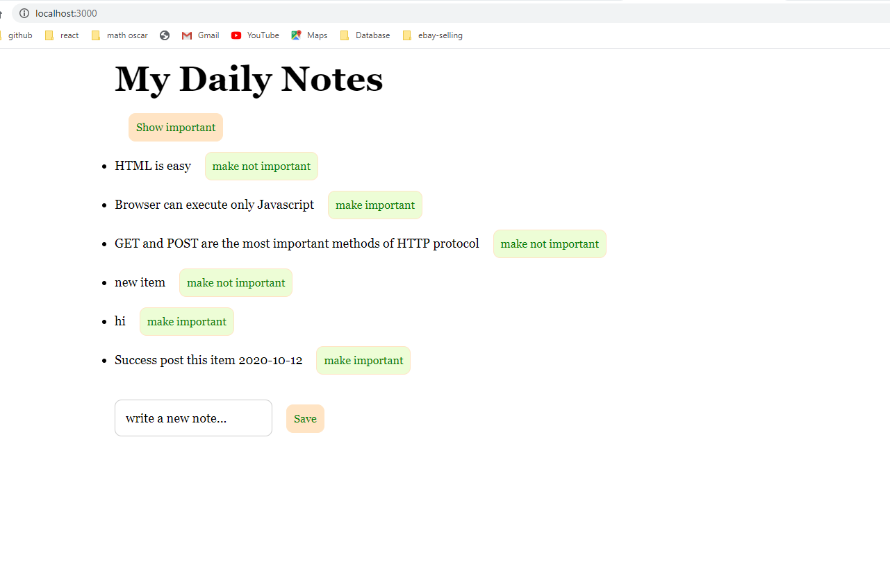
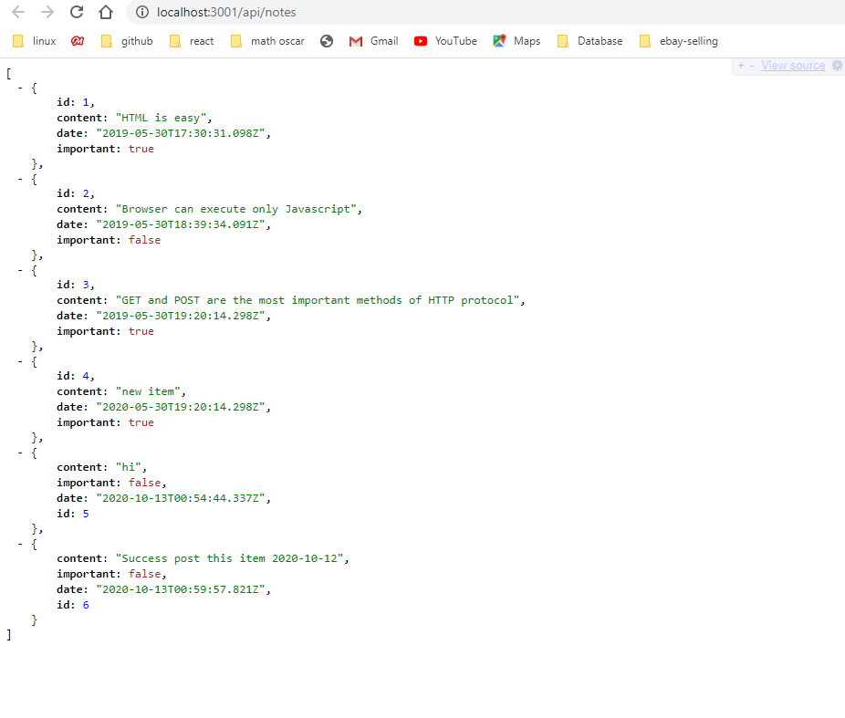

# React-form-backend

2020-10-12 Shijing Liu

This folder working with repo react-form. This is backend part.

# 3 important things needs to remember:

1. Use ... to make Math.max() get highest number of an array. generateId();

2. Install body-parser middleware to make POST working.

3. install Cors middleware.

